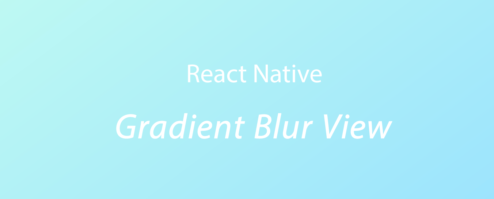

# React Native: Native Gradient Blur View

This library is a thin React Native bridge around iOS: [shashankpali/EZYGradientView](https://github.com/shashankpali/EZYGradientView)

- iOS
It is a different and unique take on creating gradients and gradients with blur on the iOS platform. The default CAGradientLayer implementation works just fine, but is confusing and gives different results than expected.

## Getting started


- `npm install react-native-gradient-blur-view --save`
- `react-native link react-native-gradient-blur-view`


## Usage

```javascript
import RNGradientBlurView from 'react-native-gradient-blur-view';
```

```javascript
<RNGradientBlurView style={styles.gradientView} />
```

## Props


| Prop              | Type       | Default | Note                                                                                                       |
| ----------------- | ---------- | ------- | ---------------------------------------------------------------------------------------------------------- |
| `firstColor`       | `string`     |         | Primary Color
| `secondColor: iOS`      | `string`     |         | Secondary Color
| `angle: iOS`       | `number`     |         | Angle of Color Division                                                            |
| `colorRatio: iOS`     | `number` |         | Color Ratio                                                      |
| `fadeIntensity` | `number` |         | Fade Intensity Value                                                   |  |
| `blurOpacity`    | `number`     |         | Blur Opacity Value                                        |  |

## Credits

- iOS: [shashankpali/EZYGradientView](https://github.com/shashankpali/EZYGradientView)

## Contribution
Contributions are welcome and are greatly appreciated! Every little bit helps, and credit will always be given.

## License
This library is provided under the MIT License.

RNGradientBlurView @ Pranav Raj Singh Chauhan


## Other Contributions
- React Native - Spruce: [react-native-spruce](https://github.com/prscX/react-native-spruce)


- React Native - App Tour Library: [react-native-taptargetview](https://github.com/prscX/react-native-taptargetview) & [react-native-material-showcase-ios](https://github.com/prscX/react-native-material-showcase-ios)


- React Native - Bottom Action Sheet: [react-native-bottom-action-sheet](https://github.com/prscX/react-native-bottom-action-sheet)


- React Native - Popover: [react-native-popover-menu](https://github.com/prscX/react-native-popover-menu)


- React Native - Tooltips: [react-native-tooltips](https://github.com/prscX/react-native-tooltips)


- React Native - Shine Button: [react-native-shine-button](https://github.com/prscX/react-native-shine-button)


- React Native Iconic: [react-native-iconic](https://github.com/prscX/react-native-iconic)


- React Native Download Button: [react-native-download-button](https://github.com/prscX/react-native-download-button)


- React Native Siri Wave View: [react-native-siri-wave-view](https://github.com/prscX/react-native-siri-wave-view)


- React Native Material Shadows: [react-native-material-shadows](https://github.com/prscX/react-native-material-shadows)


- Visual Code Essential Plugins: [vs-essential-plugins](https://github.com/prscX/vs-essential-plugins)


- Prettier Pack: [prettier-pack](https://github.com/prscX/prettier-pack)

